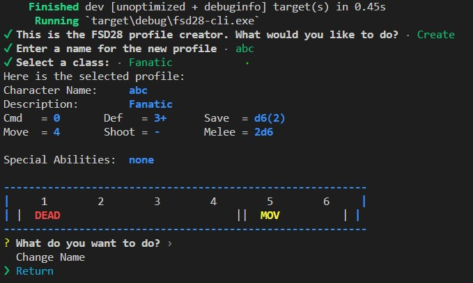

# fsd28-profiler
A custom generator for FSD28 profiles.

FSD28 is an experimental port of [Full Spectrum Dominance](https://fsd-wargame.com/) into a 28mm skirmish game. Compared to the original game the profiles building becomes critical, and a software to do so is really helpful.

## Current State 
Currently the only implementation is via CLI, but it's already better than nothing.

The tool is not functional yet, but the objective is a text-driven wizard to create profiles, and to edit them afterwards.

## Architecture
The project is divided between a proper library and a CLI software which uses the library and provides all the fancy ASCII art. 
Another module (yet to be implemented) should create fancy-looking cards for printing.
For the future of course a web-based interface is preferable, something in line with the [FSD Builder](https://github.com/thelazyone/fsd_builder) which is written with [Yew](https://github.com/yewstack/yew)

## TODOs for a MVP
To get to a minimum viablep product the following are still needed:

LIB:
- [x] implementing the default actions for units
- [x] reading and handling of weapon profiles
- [x] weapon-related actions
- [ ] options for classes
- [x] saving and loading profiles
- [x] generating a printable (even ASCII) card for each profile.

WEB
- [x] Basic framework in Yew
- [x] Save-Load with dialog
- [x] profile Visualization
- [x] Add-Remove Profiles
- [x] Edit Profiles (with forms)
- [ ] Show Mandatory actions for weapons
- [ ] Grey down actions that cannot be taken (because you didn't take a mandatory one or because you are not high tier)
- [ ] Anything Roster-Related
